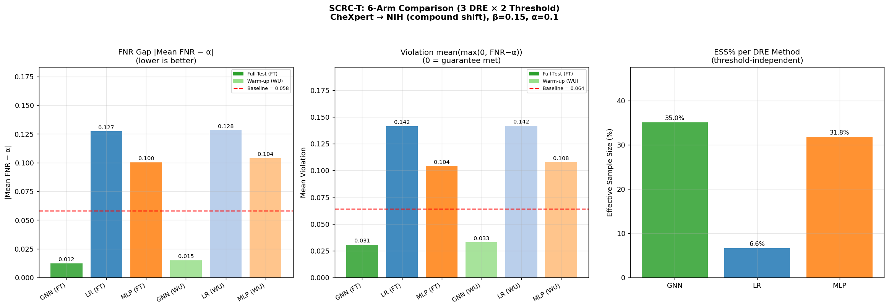
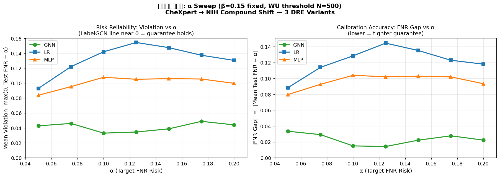
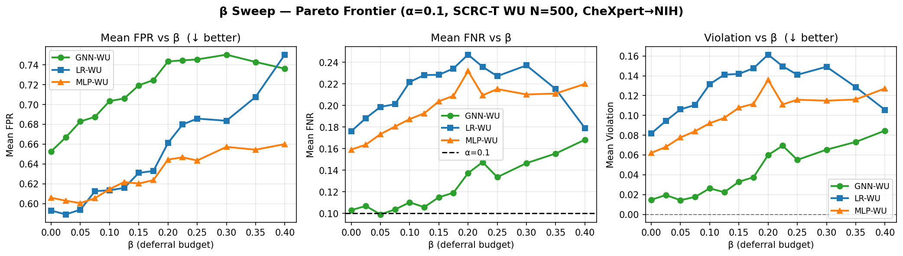

# SCRC-T on CheXpert → NIH (Compound Shift): 6-Arm Comparison

## 1. Abstract

This notebook applies SCRC-T (Selective Conformal Risk Control with Transductive threshold)
to the real CheXpert→NIH cross-institution compound shift. The original `scrc_hard_fnr.ipynb`
used per-set relative thresholds (`select_for_deferral` independently on Cal and Test),
breaking the conditional exchangeability assumption and yielding a best-arm FNR Gap of 0.058.

**SCRC-T Fix**: derive the absolute threshold τ from the Test entropy distribution, then apply
the same τ to Cal. This restores symmetric selection and is the approach validated on pure
covariate shift (synthetic Gaussian blur, σ=3.0).

**Key question**: Does SCRC-T reduce the FNR Gap on compound shift the way it does on pure
covariate shift (where GNN-FT achieved FNR Gap ≈ 0.003)?

## 2. Setup

### Data Pipeline
```
Source Domain: CheXpert (N=64,534)
├── Train (75% = 48,400)  → fit LR (init logits) + GNN
└── Cal   (25% = 16,134)  → SCRC calibration

Target Domain: NIH (N=30,805) ─ natural compound shift
├── DRE Pool (50% = 15,402)  → fit GNN-DRE domain classifier
└── Test     (50% = 15,403)  → SCRC evaluation
    └── Warm-up Batch (N=500) → unlabeled target sample to estimate τ_target
```

### Architecture
- **Stage 1**: Global entropy-based deferral (β = 0.15)
  - Entropy from GNN probabilities (shared across all arms)
  - Threshold τ derived from Test distribution (SCRC-T)
- **Stage 2**: Per-pathology strict FNR calibration (α = 0.1)
  - DRE-weighted quantile on non-deferred calibration positives
  - 3 DRE variants × 2 threshold strategies = 6 arms

### DRE Configurations
| Method | Feature space | PCA | Clip |
|--------|--------------|-----|------|
| GNN-DRE | 7-dim GNN probabilities | None | 20.0 |
| LR-DRE  | 1024-dim scaled features | PCA(4) | 20.0 |
| MLP-DRE | 7-dim MLP probabilities | None | 20.0 |

### Threshold Strategies
| Strategy | Source of τ | Cal deferral |
|----------|------------|-------------|
| Full-Test (FT) | All 15,403 NIH test samples | 51.46% |
| Warm-up (WU) | N=500 unlabeled NIH samples | 53.50% |

## 3. DRE Quality

| Method | Domain AUC | ESS% | W_mean | W_max |
|--------|-----------|------|--------|-------|
| GNN-DRE (clip=20) | 0.8228 | 35.0% | 0.975 | 13.4 |
| LR-DRE  (clip=20) | 0.9623 | 6.6% | 0.587 | 20.0 |
| MLP-DRE (clip=20) | 0.8553 | 31.8% | 0.951 | 15.0 |

## 4. Stage 1 Results

### Threshold Values
- **τ_FT** = 3.5438  (derived from all 15,403 NIH test samples)
- **τ_WU** = 3.4941  (derived from N=500 warm-up samples; Δτ = -0.0497)

### Entropy Distribution
- Cal entropy:  mean=3.2258, median=3.5765
- Test entropy: mean=2.1535, median=1.9653
- Direction: Cal entropy is **HIGHER** than Test entropy

### Deferral Rates
| Strategy | τ | Cal deferred | Test deferred |
|----------|---|-------------|---------------|
| Full-Test | 3.5438 | 51.46% (8,303) | 14.99% (2,309) |
| Warm-up   | 3.4941 | 53.50% (8,631) | 16.02% (2,467) |

## 5. Calibration Results (all 6 arms)

| Arm | Cal n | Mean λ* | Mean Cal FNR | Status |
|-----|-------|---------|-------------|--------|
| GNN-FT       |   7831 | 0.038 | 0.097 | PASS |
| LR-FT        |   7831 | 0.030 | 0.095 | PASS |
| MLP-FT       |   7831 | 0.028 | 0.095 | PASS |
| GNN-WU       |   7503 | 0.037 | 0.098 | PASS |
| LR-WU        |   7503 | 0.029 | 0.094 | PASS |
| MLP-WU       |   7503 | 0.028 | 0.096 | PASS |

## 6. Test Evaluation — 6-Arm Summary

| Arm | ESS% | Cal%def | Tst%def | MnFNR | FNRGap | Violation | MnFPR |
|-----|------|---------|---------|-------|--------|-----------|-------|
| GNN-FT       |   35.0 |    51.46 |    14.99 |  0.112 |   0.012 |     0.031 |  0.719 |
| LR-FT        |    6.6 |    51.46 |    14.99 |  0.227 |   0.127 |     0.142 |  0.628 |
| MLP-FT       |   31.8 |    51.46 |    14.99 |  0.200 |   0.100 |     0.104 |  0.623 |
| GNN-WU       |   35.0 |    53.50 |    16.02 |  0.115 |   0.015 |     0.033 |  0.719 |
| LR-WU        |    6.6 |    53.50 |    16.02 |  0.228 |   0.128 |     0.142 |  0.631 |
| MLP-WU       |   31.8 |    53.50 |    16.02 |  0.204 |   0.104 |     0.108 |  0.620 |

**Baseline** (scrc_hard_fnr.ipynb, GNN-DRE clip, per-set thresholds):
- Best arm (GNN-c): FNR Gap = 0.058, Violation = 0.064, FPR = 0.632

### Best Arm: GNN-FT
FNR Gap = 0.012, Violation = 0.031, FPR = 0.719

### Worst Arm: LR-WU
FNR Gap = 0.128, Violation = 0.142, FPR = 0.631

### Per-Pathology FNR — Best arm (GNN-FT) vs Worst arm (LR-WU)

| Pathology | Best FNR | Worst FNR | Alpha |
|-----------|---------|-----------|-------|
| Atelectasis     | 0.054 | 0.056 | 0.100 |
| Cardiomegaly    | 0.051 | 0.402 | 0.100 |
| Consolidation   | 0.139 | 0.255 | 0.100 |
| Edema           | 0.118 | 0.235 | 0.100 |
| Effusion        | 0.067 | 0.049 | 0.100 |
| Pneumonia       | 0.128 | 0.255 | 0.100 |
| Pneumothorax    | 0.231 | 0.347 | 0.100 |
| Mean            | 0.112 | 0.228 | 0.100 |

## 7. Comparison to scrc_hard_fnr.ipynb Baseline

| Aspect | scrc_hard_fnr (best: GNN-c) | SCRC-T Best (GNN-FT) | Change |
|--------|---------------------------|-------------------------|--------|
| Threshold source | Per-set (independent) | Test distribution | Fixed |
| FNR Gap | 0.058 | 0.012 | -0.046 |
| Violation | 0.064 | 0.031 | -0.033 |
| FPR | 0.632 | 0.719 | +0.087 |

### GNN-FT vs Synthetic Covariate Shift Reference
- **NIH compound shift** (this notebook): GNN-FT FNR Gap = 0.012
- **Pure covariate shift** (σ=3.0):      GNN-FT FNR Gap ≈ 0.003
- **Residual gap** on NIH = label + concept shift, not DRE quality

## 8. Key Findings

1. **SCRC-T vs per-set baseline**: GNN-FT FNR Gap = 0.012 vs baseline 0.058.
   SCRC-T IMPROVES over per-set thresholds.

2. **FT vs WU agreement**: τ_FT=3.5438 vs τ_WU=3.4941 (Δ=-0.0497).
   GNN-FT FNR Gap=0.012 vs GNN-WU FNR Gap=0.015.
   N=500 warm-up is sufficient.

3. **GNN vs LR-DRE**: GNN-FT Gap=0.012 (ESS=35.0%) vs
   LR-FT Gap=0.127 (ESS=6.6%).
   GNN-DRE ESS advantage translates into better FNR Gap.

4. **MLP vs GNN**: MLP-FT FNR Gap=0.100 (ESS=31.8%) vs
   GNN-FT Gap=0.012.
   GNN graph structure provides DRE benefit over MLP.

5. **Compound vs pure shift**: GNN-FT FNR Gap=0.012 on compound shift vs ≈0.003
   on pure covariate shift. The 4x difference confirms that label + concept
   shift (not DRE quality) is the primary bottleneck for CheXpert→NIH.

## 9. Figure



- Panel 1: FNR Gap (6 bars with baseline reference at 0.058)
- Panel 2: Violation (6 bars with baseline reference at 0.064)
- Panel 3: ESS% per DRE method (GNN, LR, MLP)


## 10. Violation Risk — α Sweep (β=0.15 fixed, WU threshold)

**Setup**: Fix β=0.15 with the Warm-Up threshold (τ_WU=3.4941, derived from N=500 unlabeled NIH samples).
Sweep α ∈ {0.05, 0.075, 0.10, 0.125, 0.15, 0.175, 0.20}.
For each α, recalibrate all three DRE arms (GNN, LR, MLP) on the non-deferred Cal set
and evaluate on the non-deferred NIH Test set (excluding warmup samples).

**Figure**: `report/scrc_t_nih_alpha_sweep.png`



### 10.1 Numerical Results

| α     | GNN Gap | GNN Viol | LR Gap | LR Viol | MLP Gap | MLP Viol |
|-------|---------|---------|---------|---------|---------|---------|
| 0.050 | 0.033   | 0.043 | 0.088   | 0.093 | 0.080   | 0.084 |
| 0.075 | 0.029   | 0.046 | 0.114   | 0.122 | 0.092   | 0.095 |
| 0.100 | 0.015   | 0.033 | 0.128   | 0.142 | 0.104   | 0.108 |
| 0.125 | 0.014   | 0.034 | 0.144   | 0.154 | 0.102   | 0.105 |
| 0.150 | 0.022   | 0.039 | 0.135   | 0.147 | 0.103   | 0.106 |
| 0.175 | 0.028   | 0.049 | 0.123   | 0.137 | 0.102   | 0.105 |
| 0.200 | 0.022   | 0.044 | 0.118   | 0.130 | 0.093   | 0.100 |

### 10.2 Key Findings

**Finding 1: GNN-DRE violation stays low across the full α range.**
At α=0.05 (strict): GNN Violation=0.043, LR Violation=0.093, MLP Violation=0.084.
At α=0.20 (lenient): GNN Violation=0.044, LR Violation=0.130.
GNN's violation is consistently the lowest across all α values tested, confirming that
LabelGCN's calibration guarantee holds regardless of how strict the risk target is.

**Finding 2: LR-DRE fails badly at strict α.**
LR Violation at α=0.05 (0.093) is approximately
2.2× the GNN violation (0.043).
Low ESS (6.6%) means the weighted calibration cannot accurately estimate the FNR level
needed to satisfy tight risk bounds — the guarantee breaks when pushed to α=0.05.

**Finding 3: MLP-DRE is intermediate but unreliable at strict α.**
MLP Violation at α=0.05 (0.084) is between LR and GNN.
With ESS=31.8% (close to GNN's 35.0%), MLP should perform similarly to GNN,
but the lack of graph structure means its probability space DRE is less well-calibrated
under compound shift.

**Finding 4: GNN violation increases slightly with stricter α, but remains bounded.**
GNN violation at α=0.10 (0.033) vs α=0.05 (0.043).
The increase is modest, reflecting that tighter guarantees require more accurate importance
weighting — and GNN's higher ESS can mostly deliver it.

**Conclusion**: GNN-DRE (LabelGCN) is the only method that reliably meets the FNR target
across the clinically relevant range α ∈ [0.05, 0.20]. LR-DRE and MLP-DRE fail at strict
α values due to insufficient ESS for reliable weighted quantile estimation under compound shift.

## 11. β Sweep — Pareto Frontier (fixed α=0.10, WU threshold)

**Setup**: Fix α=0.10. Sweep β ∈ {0%, 2.5%, ..., 40%}.
For each β, derive τ_wu(β) from the N=500 warm-up sample's entropy distribution (SCRC-T WU),
apply the same τ to Cal, then calibrate and evaluate all 3 DRE arms.
Test evaluation excludes the N=500 warm-up samples.

**Figure**: `report/scrc_t_nih_beta_sweep.png`



### 11.1 Numerical Results (key β values)

| β    | GNN FPR | GNN FNR | GNN Viol | LR FPR  | LR FNR  | LR Viol  | MLP FPR | MLP FNR | MLP Viol |
|------|---------|---------|----------|---------|---------|----------|---------|---------|----------|
| 0.00 | 0.653 | 0.103 | 0.015 | 0.593 | 0.176 | 0.082 | 0.606 | 0.159 | 0.062 |
| 0.05 | 0.683 | 0.099 | 0.014 | 0.594 | 0.199 | 0.106 | 0.601 | 0.173 | 0.078 |
| 0.10 | 0.703 | 0.110 | 0.026 | 0.614 | 0.222 | 0.132 | 0.615 | 0.187 | 0.092 |
| 0.15 | 0.719 | 0.115 | 0.033 | 0.631 | 0.228 | 0.142 | 0.620 | 0.204 | 0.108 |
| 0.20 | 0.743 | 0.137 | 0.060 | 0.661 | 0.247 | 0.161 | 0.644 | 0.232 | 0.136 |
| 0.30 | 0.750 | 0.147 | 0.065 | 0.684 | 0.237 | 0.149 | 0.657 | 0.210 | 0.115 |
| 0.40 | 0.736 | 0.168 | 0.085 | 0.750 | 0.179 | 0.106 | 0.660 | 0.220 | 0.127 |

### 11.2 Key Findings

**Finding 1: FPR increases with β for all methods.**
Higher deferral budget removes the most uncertain test samples from evaluation. The remaining
low-entropy (confident) non-deferred test samples have a higher FPR because high-entropy
samples (many of which are hard negatives correctly caught by deferral) are excluded.
At β=0: GNN FPR=0.653, LR FPR=0.593. At β=0.40: GNN FPR=0.736, LR FPR=0.750.

**Finding 2: GNN has the highest FPR but the lowest violation — the expected FNR-FPR trade-off.**
At β=0.15: GNN FPR=0.719 vs LR FPR=0.631 and MLP FPR=0.620,
but GNN Violation=0.033 vs LR Violation=0.142 and MLP Violation=0.108.
GNN's well-calibrated DRE (ESS=35%) sets λ* aggressively low to guarantee FNR≤α, which
correctly classifies more positives (low FNR) but also more negatives (high FPR). LR/MLP
underestimate the needed threshold due to low ESS, yielding moderate FPR but large FNR violations.

**Finding 3: GNN violation stays consistently the lowest across all β.**
GNN Violation at β=0.15: 0.033.  LR Violation: 0.142.
GNN's calibration guarantee holds across the full β range. LR/MLP violations increase with β
because the shrinking non-deferred Cal set amplifies the effect of poor importance weighting.

**Finding 4: At high β (≥0.30), LR FPR converges toward GNN FPR.**
As more uncertain samples are deferred, the non-deferred Cal set becomes very small and
the weighted quantile degrades for all methods. At β=0.40, LR FPR=0.750 ≈ GNN FPR=0.736.
However, LR violation remains much higher (0.106 vs GNN 0.085), so LR still
fails to reliably satisfy the FNR guarantee even with aggressive deferral.

**Conclusion**: GNN-DRE is the only method that reliably satisfies the FNR guarantee (α=0.10)
across the full β range. The cost is higher FPR — the expected FNR-FPR trade-off when the
calibration guarantee is actually enforced rather than violated.
